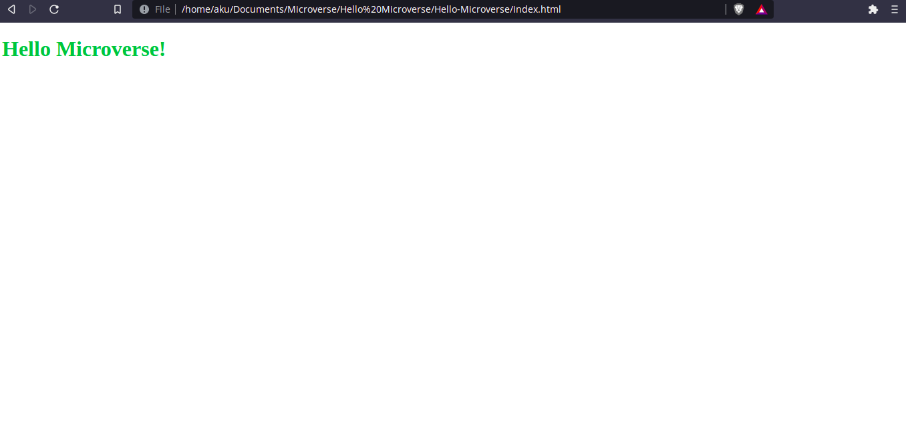

# Hello Microverse

> Hello Microverse repository contains html and css.

Hello Microverse project.

## Built With

- html/css
- Linters(html/css)

## Authors

👤 **Aku**

- GitHub: [@aakbarkhan](https://github.com/aakbarkhan)

## 🤝 Contributing

Contributions, issues, and feature requests are welcome!

Feel free to check the [issues page](../../issues/).

## Show your support

Give a ⭐️ if you like this project!

## Acknowledgments

- My coding partners.
- My morning session team.
- My standup team.

## 📝 License

This project is [MIT](./MIT.md) licensed.